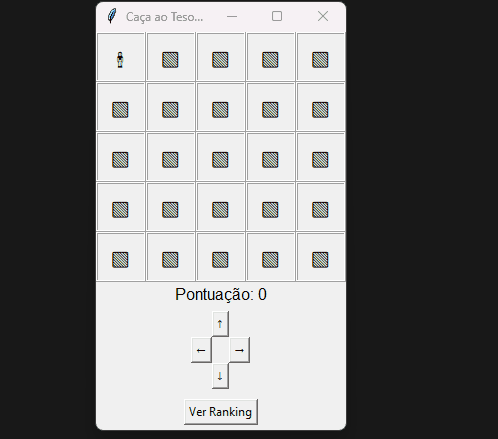

Projeto simples feito com Python e Tkinter, onde o objetivo é encontrar um tesouro escondido em um mapa. A cada movimento, a pontuação aumenta. No final do jogo, a pontuação é salva em um banco de dados local (SQLite).

---

 Como funciona

- O jogador começa na posição (0, 0) no mapa.
- Cada movimento aumenta a pontuação.
- O tesouro está escondido em uma posição aleatória.
- Ao encontrar o tesouro, o jogo pede seu nome e salva sua pontuação.
- Também é possível visualizar os melhores resultados no ranking.

---

 Estrutura do projeto

caca-ao-tesouro/
├── main.py # Interface com Tkinter
├── jogo.py # Funções e lógica do jogo
├── config.py # Arquivo de configurações (tamanho do mapa, símbolos)
├── bd.py # Gerencia banco de dados SQLite
└── README.md # Este arquivo

---

 Tecnologias utilizadas

- Python 3.x
- Tkinter (para interface gráfica)
- SQLite3 (banco de dados local)

---

Como executar

1. Certifique-se de ter o Python instalado (3.8 ou superior).
2. Clone este repositório:
   ```bash
   git clone https://github.com/seu-usuario/caca-ao-tesouro.git
   cd caca-ao-tesouro

  Play the game with : 
  python main.py

  ## 🖼️ Demonstração do Jogo



